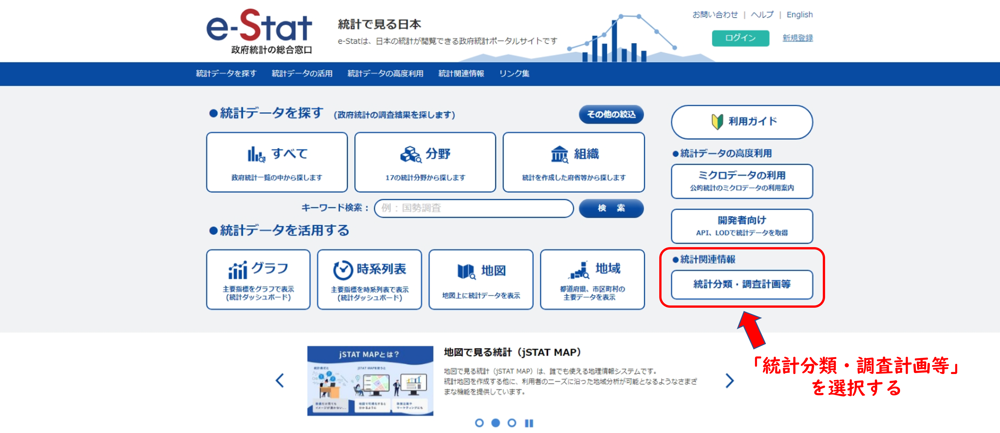
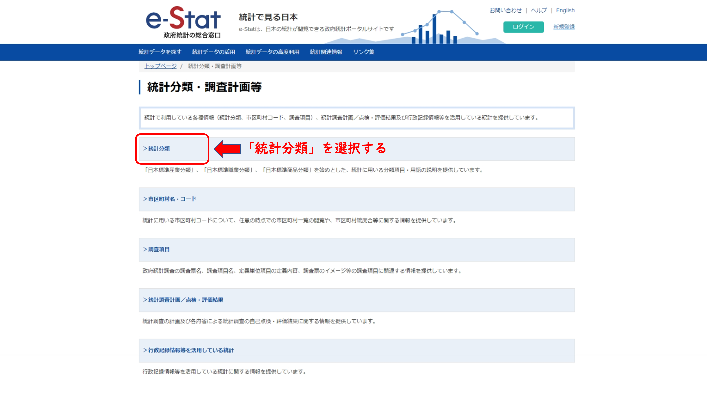
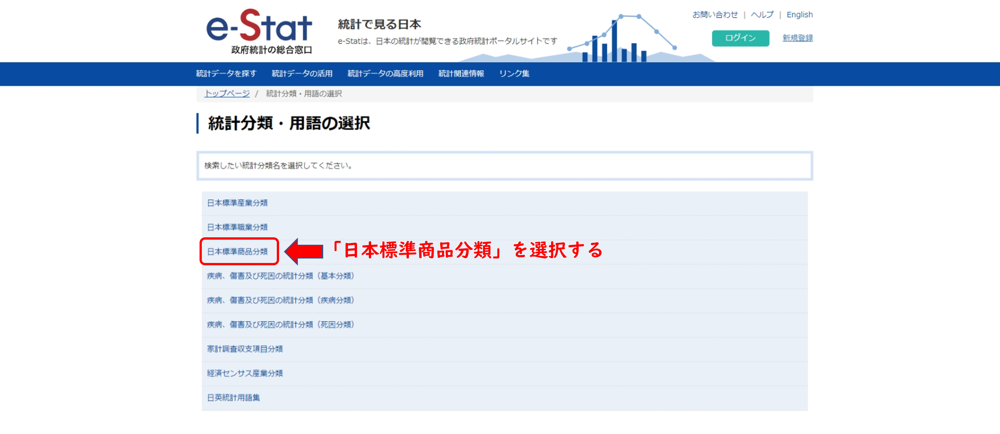
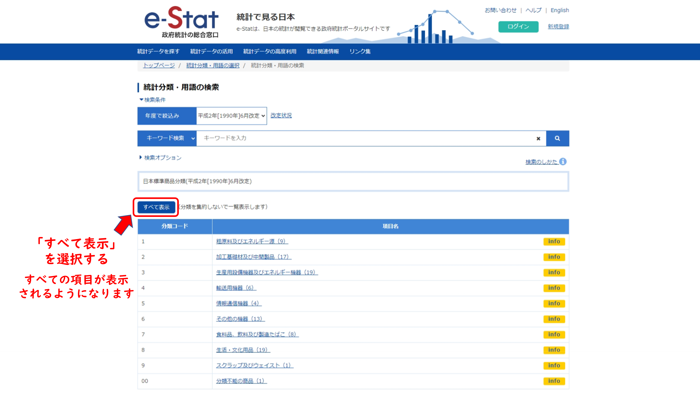
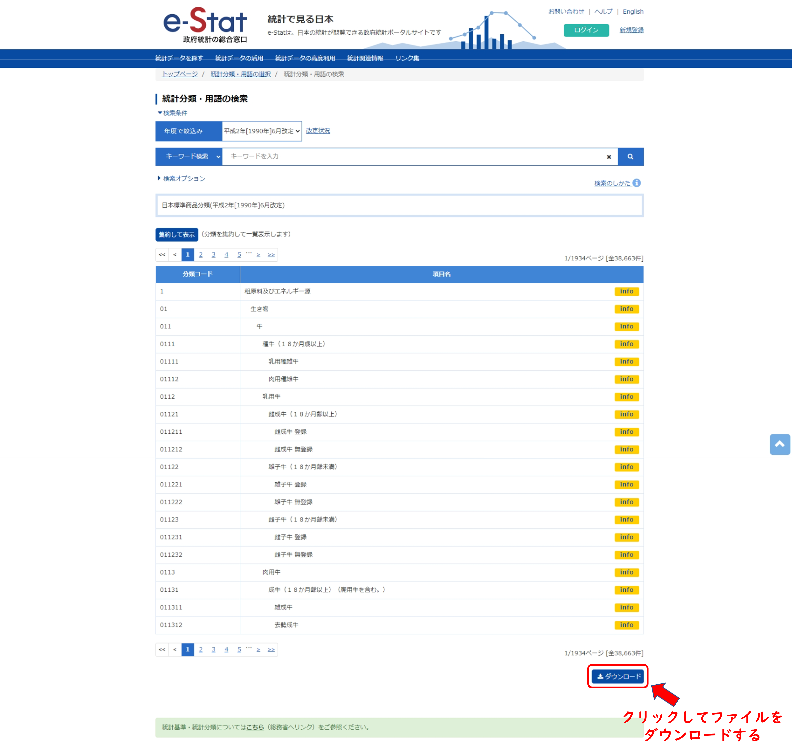
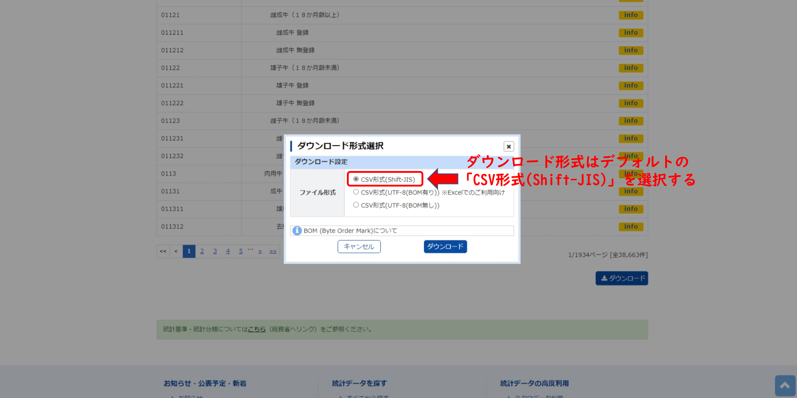

日本標準商品分類 (JSCC)
================
2023-06-19 (updated: 2023-07-04)

## 分類表の取得方法

#### 1. WEB サイトトップ画面の表示

以下のリンクより、e-stat トップページを表示する。

<https://www.e-stat.go.jp/>

#### 2. ダウンロードページの表示

トップページより統計分類に関するページへ移動する。

該当するカテゴリーを順次選択する。

#### 3. ダウンロードの実行

該当ページより全件を取得するために以下の操作を行う。

ページ下部のボタンをクリックし、ダウンロードを実行する。

ファイルの形式を問われるので、デフォルトを指定する

### 4. マスターの作成

以下のテーブル構造となるようファイルを加工し、マスターを得る

| 列番号 | 変数名         | 型     |
|--------|----------------|--------|
| 1      | 薬効分類コード | 整数   |
| 2      | 薬効分類名     | 文字列 |
